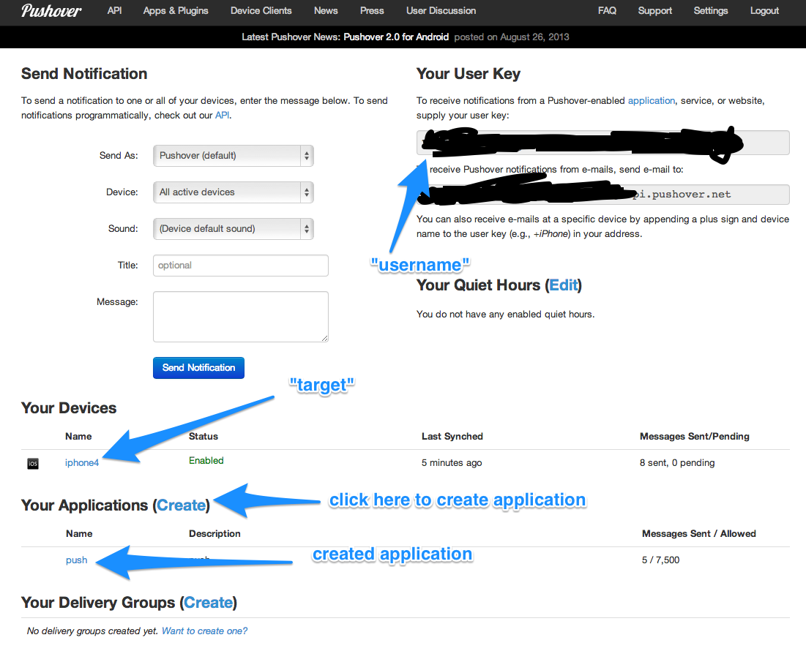
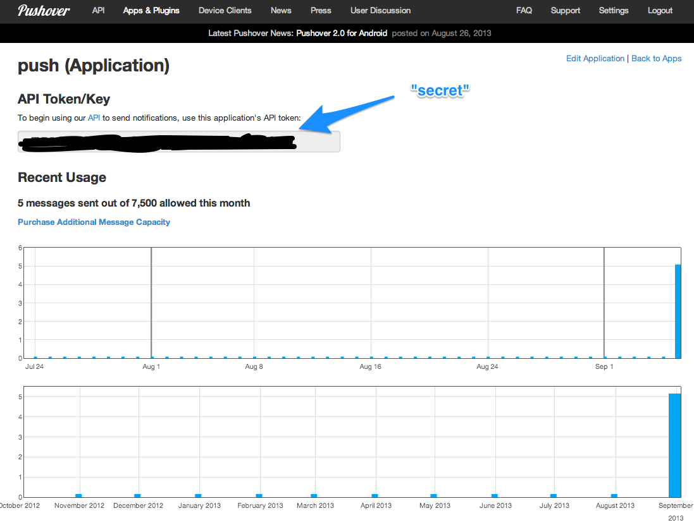

ZNC Push via Pushover
=====================

This section contains the specific steps to configure for [Pushover][] after you install the
module by following the above steps.

Install Pushover Client with Registered Account
-----------------------------

Go to [Pushover.net][Pushover] and sign up for a free account. Install one of the
[clients][] and make sure that you are logged in. After you log in from
the client, it will show up in the web UI.

Name your device to something you prefer, e.g., iphone4. This will be the value for the "target" in
push configuration below

You can also see your **user key** thorugh the web UI after you log in. Copy it down. This will be
the value for "username" field in the push configuration below

Create an Application on Pushover
-------------------------------

Through pushover website, create an applicatino by clicking on the "Create" button and give it a name
you prefer. You will come to the application detail page, which will have the **API Token/Key**.
Copy it down. This will be the value for "secret" field in the push configuration below.

Configure push module
-----------------------------

Following these steps in your IRC client that is connected to your bouncer:

* set secret to the **API Token/Key**: <code>/msg *push set secret your-api-token-key</code>
* set service to 'pushover': <code>/msg *push set service pushover</code>
* set target to your device name: <code>/msg *push set target iphone4</code>
* set username to your **user key**: <code>/msg *push set username your-user-key</code>

You should be all set with the rest of the default. But here is how you can test it.

* Turn debug on in case of test failure: <code>/msg *push set debug on</code>
* Send yourself a message: <code>/msg *push send test</code>
* You should see debugging message in the IRC channel. If it works, you should get a push notification
on your phone. If not, the debugging message will give you more information
* Turn the debug off when you are done: <code>/msg *push set debug off</code>

Screenshots
--------------------------------

The following are the screenshots to illustrate how you can find out the information

[Pushover]: http://pushover.net
[clients]: http://pushover.net/clients
